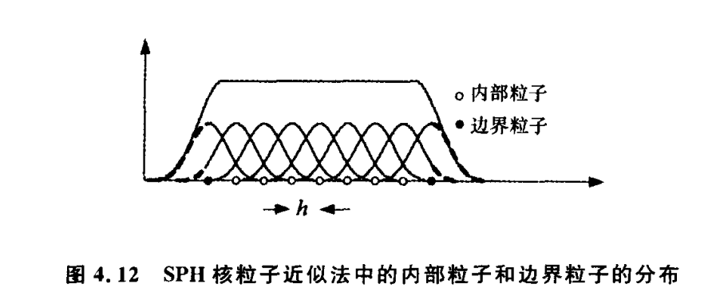

# 边界处理和多相模拟

题外话：因为最近导师交给我一个小工程做，这次的内容可能不算丰富。原本想展示一些SPHysics软件的运行结果，比较生动形象。

本周课程讲到的是数值造波的一些技术：大体的思路是采用势流理论的解析解，赋值给粘流造波数值计算。

在SPH方法中，造波就意味着离不开边界处理，比如造波机就是流体求解域的边界。课程老师希望我尝试介绍一下现在SPH法中的一些多相模拟技术。

## 边界处理

由于SPH方法使用粒子的离散形式，在边界处，粒子近似将出现紧支域被边界截断的情况。如下图：

### 三种典型边界条件

1. 壁面边界（至少满足不可穿透边界条件）：自由滑移边界、无滑移边界；
2. 自由液面边界；
3. 流入流出边界。

壁面边界的处理一直是SPH方法发展过程中需要重点解决的问题。欧洲光滑粒子研究兴趣共同体（SPHERIC）将固壁边界的处理列为几大挑战性问题之一。

### SPH边界处理方法

1. 动态边界；
2. 排斥力边界；
3. 周期开放边界；
4. 等等。

## 多相模拟

### 自由液面流动

2009年，Colagrossi等人从理论的角度证明了弱可压SPH方法在自由液面处能自动满足自由液面边界条件，且自由液面处核函数的截断不影响自由液面模拟的精度。

### 流固耦合动力学

流固耦合动力学问题中最主要的难点在于刚体或弹性体运动与流场运动的耦合。
SPH方法在模拟流固耦合问题时有两类方法，分别是： 
（1）采用纯粒子法对流场和固体结构进行统一建模； 
（2）SPH方法与其它数值方法（如有限元）耦合计算。

SPH方法在模拟剧烈流固耦合问题中已经取得了很大进步，但是考虑结构表明边界层效应的流固耦合SPH方法较为少见。

采取自适应粒子细化、聚合技术，在提高局部计算精度的基础上，减小总计算量，为较大规模船舶与海洋工程水动力学问题的数值计算提供技术支撑。

### 多相流

SPH方法基于拉格朗日观点，在模拟多相流问题时无需特意追踪水气界面，而且模拟多相流界面的破碎和融合时，无需额外的人工干预。

在物体入水研究中，空气的卷入对入水过程的运动和载荷特性有较大的影响。而且，在多相流SPH方法中，受空气粒子密度较小的影响，时间步会比单相流（水）SPH方法中小很多。

## 参考文献

[1] 孙鹏楠. 物体与自由液面耦合作用的光滑粒子流体动力学方法研究.